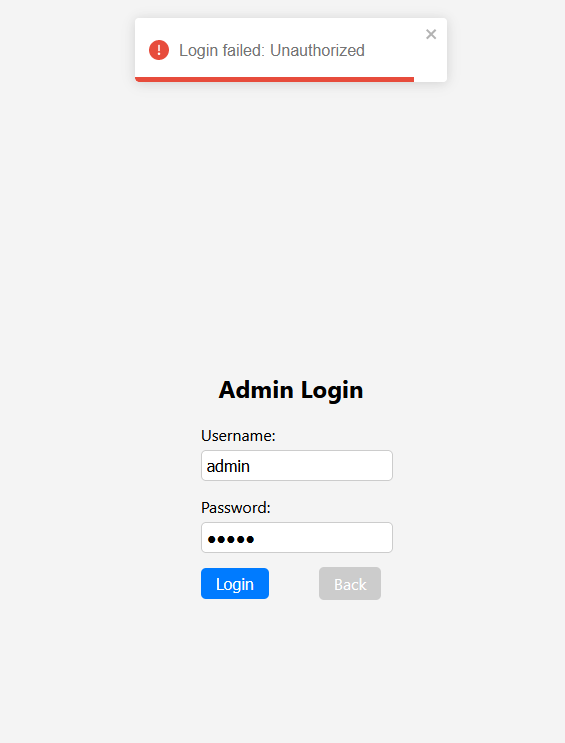

# Business Trip Reimbursement App


## Overview

The Business Trip Reimbursement App is a containerized application developed using Java and React. It provides a user-friendly interface for employees to submit and manage reimbursement requests for their business trips. The application is divided into a frontend and a backend, each serving a specific role in the reimbursement process.

## Features

-   **Frontend**: The frontend is built using React, offering an intuitive and interactive user interface for employees. It allows users to:
    -   Submit reimbursement requests, including details such as receipts, travel dates, names, and distances traveled by car.
    -   Receive a calculated reimbursement amount based on provided information.
-   **Backend**: The backend is built using Java 11 with Maven, and it utilizes several libraries including:
    -   H2 database: Used to store reimbursement data and manage receipts.
    -   Mockito: Enables mocking for unit testing.
    -   JUnit 5: Provides a robust framework for testing Java applications.
    -   Jackson: Used for JSON serialization and deserialization.


## Getting Started
Follow these steps to run the application using Docker:

1. Clone the repository:


   ```sh
   git clone https://github.com/Zaitis/BusinessTripReimbursementApp.git
   cd BusinessTripReimbursementApp
   ```

2. Build and run the application using Docker Compose:
	```sh
	docker-compose up
	```
3.  Access the frontend at: [http://localhost:3000](http://localhost:3000)
  
 4.  Access the backend at: [http://localhost:8000](http://localhost:8000)
    
 5. Run tests:
  ```sh
   cd /Backend
   mvn test
   ```

## Docker Configuration

-   The backend Dockerfile is located in the `Backend` directory.
-   The frontend Dockerfile is located in the `Frontend` directory.
-   The `docker-compose.yml` file orchestrates the containers for both frontend and backend.

## Backend

-   The backend server is built with Java using Maven.
-   The H2 database is used for data storage.
-   To access the H2 database console, visit: [http://localhost:8082](http://localhost:8082)
    -   JDBC URL: `jdbc:h2:mem:test`
    -   Username: `sa`
    -   Password: `sa`
## Frontend

Visit [http://localhost:3000](http://localhost:3000) to explore the application's UI. For administrative access, log in at [http://localhost:3000/admin-login](http:/localhost:3000/admin-login) with the credentials:

-   Username: admin
-   Password: password

## Screenshots





 

## Contributing

Contributions are welcome! Please follow these steps to contribute:

1.  Fork the repository.
2.  Create a new branch for your feature or bug fix.
3.  Commit your changes and push to your forked repository.
4.  Open a pull request with a description of your changes.


## Contact

For any questions or inquiries, please contact [krzysztof@painm.pl](mailto:krzysztof@painm.pl).
